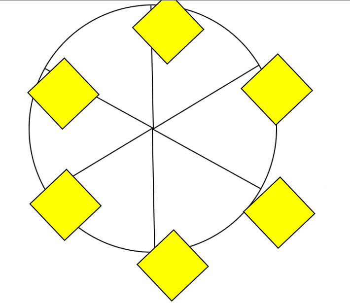

# FreeCodeCamp Ferris Wheel

Learn CSS Animations by Building a Ferris Wheel

# Preview

# What I learned

- The `transform-origin` property is used to set the point around which a CSS transformation is applied.
- The `@keyframes` at-rule is used to define the flow of a CSS animation. Within the `@keyframes` rule, you can create selectors for specific points in the animation sequence, such as `0%` or `25%`, or use `from` and `to` to define the start and end of the sequence.
- The `animation-name` property is used to link a `@keyframes` rule to a CSS selector.
- The `animation-duration` property is used to set how long the animation should sequence to complete.
- The `animation-iteration-count`
 property sets how many times your animation should repeat.
- The `animation-timing-function`
 property sets how the animation should progress over time.
- `animation` can set all four properties mentioned above.

# Conclusion

My current goal is to master React, but first I need to complete some begginer courses on FreeCodeCamp, but at the same time I'm learning some new things like I pointed above.
